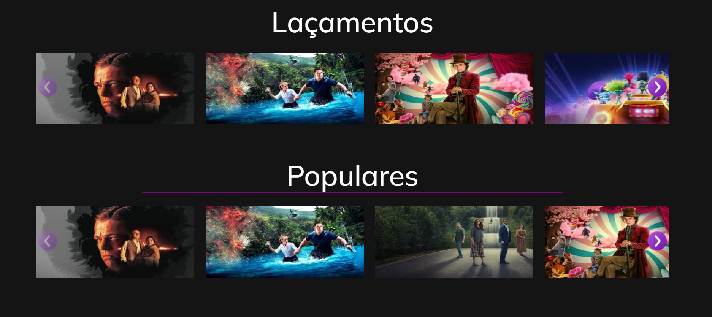

# Home Play
### Uma aplicação de serviço de streaming de filmes. 
Aqui você pode assistir aos seus filmes favoritos, ainda mergulhar em um mundo de novidades, com a imensa gama de títulos, para nunca enjoar e sempre ter uma aventura emocionante para se divertir nos fins de semana.

## Tecnologias utilizadas:
React com javascript,
react router,
axios para requisições http,
react bootstrap para estilização e criação de componentes.

#### Projeto criado usando React + Vite

This template provides a minimal setup to get React working in Vite with HMR and some ESLint rules.

Este template fornece uma configuração mínima para ter o React funcionando no Vite com HMR e algumas regras de ESLint.

Currently, two official plugins are available:
Atualmente, dois plugins oficiais estão disponíveis:

- [@vitejs/plugin-react](https://github.com/vitejs/vite-plugin-react/blob/main/packages/plugin-react/README.md) uses [Babel](https://babeljs.io/) for Fast Refresh
- [@vitejs/plugin-react-swc](https://github.com/vitejs/vite-plugin-react-swc) uses [SWC](https://swc.rs/) for Fast Refresh
